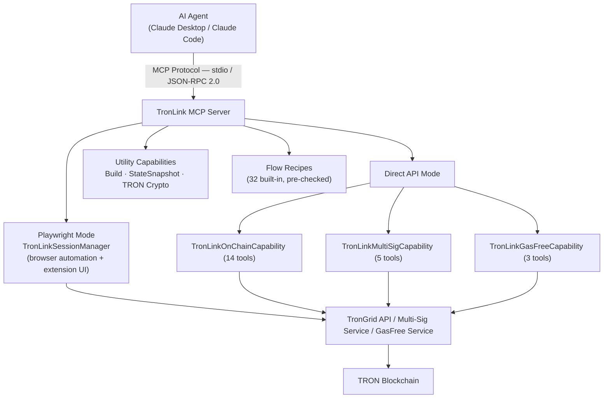

# MCP Server TronLink 

## Overview

**GitHub**: [https://github.com/TronLink/mcp-server-tronlink](https://github.com/TronLink/mcp-server-tronlink)

**mcp-server-tronlink** is a production-ready Model Context Protocol (MCP) server that enables AI agents (Claude, GPT, etc.) to interact with the TRON blockchain through natural language. Built on `@tronlink/tronlink-mcp-core`, it provides **55 tools** in `list_tools` — **52 core tools** registered by [`tronlink-mcp-core`](tronlink-mcp-core.md) + **3 wallet management tools** registered locally by this server's [`src/wallet-tools.ts`](https://github.com/TronLink/mcp-server-tronlink/blob/main/src/wallet-tools.ts) — across two complementary operation modes.

**Key Highlights:**
- Dual-mode architecture: **Playwright** (browser automation) + **Direct API** (on-chain operations)
- 32 built-in Flow Recipes with pre-checks and dependency resolution
- Non-custodial local transaction signing via encrypted `agent-wallet`
- Multi-signature management with real-time WebSocket monitoring
- Gas-free TRC20 transfers via GasFree service integration

---

## Architecture



Both modes can run simultaneously and tools are auto-enabled based on configuration.

---

## Dual-Mode Operation

### Mode 1: Playwright (Browser Automation)

Controls the TronLink Chrome extension via Playwright Chromium. Ideal for **E2E testing, UI validation, and DApp interaction**.

**Capabilities:**
- Launch browser with `--load-extension` flag for TronLink
- Auto-detect extension ID from Chrome API
- Multi-tab tracking with automatic role classification (extension / notification / dapp / other)
- DOM-based state extraction (TRON address, TRX balance, network detection)
- Screenshot capture with base64 encoding
- Automatic browser dialog handling (alerts, confirms, prompts)

**27 Playwright tools include:** `tl_launch`, `tl_cleanup`, `tl_navigate`, `tl_click`, `tl_type`, `tl_screenshot`, `tl_accessibility_snapshot`, `tl_describe_screen`, etc.

> The "27" is **`52 core − 22 chain/multisig/gasfree − 3 mode-agnostic (run_steps, list_flows, set_context) = 27`**. `tl_clipboard`, `tl_keyboard`, `tl_scroll`, etc. are Playwright-mode UI tools and counted in the 27.

### Mode 2: Direct API + Wallet Management

Operates directly against TronGrid / multi-sig / GasFree REST APIs — no browser required. Ideal for **account queries, transfers, swaps, staking, multi-sig management, and runtime wallet hot-swap**.

**28 tools** = 22 mode-2 API tools (from core) + 3 mode-agnostic core tools + 3 wallet management tools (from this server). Grouping:

| Group | Tools | Source | Description |
|-------|-------|--------|-------------|
| On-Chain | 14 | core | Transfer, stake, swap, query, multisig setup |
| Multi-Signature | 5 | core | Permission query, tx submit, WebSocket monitoring |
| GasFree | 3 | core | Zero-gas TRC20 transfers |
| Wallet Management | 3 | **this server** (`src/wallet-tools.ts`) | List wallets, auto-create a wallet, switch the active wallet |
| Mode-agnostic | 3 | core | `tl_run_steps`, `tl_list_flows`, `tl_set_context` — invoked from either mode |

> **Why the breakdown differs from the architecture diagram.** The architecture node only enumerates capability classes (`OnChainCapability`, `MultiSigCapability`, `GasFreeCapability`). Wallet management lives outside the capability interface — it's registered by `src/wallet-tools.ts` and hot-swaps wallets into running capabilities via the `onWalletSwap` callback in [`src/index.ts`](https://github.com/TronLink/mcp-server-tronlink/blob/main/src/index.ts).

---

## Core Components

### 1. TronLinkSessionManager

Full browser lifecycle management:

| Method | Description |
|--------|-------------|
| `launch()` | Initialize browser with TronLink extension |
| `getExtensionState()` | Extract wallet state from UI |
| `navigateToUrl()` | Navigate to a specific URL |
| `navigateToNotification()` | Open TronLink notification popup |
| `screenshot()` | Capture current UI state |
| `getTrackedPages()` | List all open browser tabs |
| `cleanup()` | Graceful shutdown of all resources |

**Screen Detection:** Auto-detects 15 TronLink screens: `home`, `login`, `settings`, `send`, `receive`, `sign`, `broadcast`, `assets`, `address_book`, `node_management`, `dapp_list`, `create_wallet`, `import_wallet`, `notification`, `unknown`.

### 2. TronLinkOnChainCapability (14 Tools)

Direct API wrapper for TronGrid:

**Query Operations:**
- `getAddress()` — Get the TRON address from encrypted local `agent-wallet`
- `getAccount()` — Balance, bandwidth, energy, permissions
- `getTokens()` — TRC10 and TRC20 token balances
- `getTransaction()` — Transaction details by txID
- `getHistory()` — Transaction history with pagination
- `getStakingInfo()` — Staking status (frozen amounts, votes, unfreezing)

**Transaction Operations:**
- `send()` — Transfer TRX, TRC10, or TRC20 tokens
- `stake()` — Freeze/unfreeze TRX for bandwidth or energy (Stake 2.0)
- `resource()` — Delegate/undelegate bandwidth or energy
- `swap()` — Token swap via SunSwap V2
- `swapV3()` — Token swap via SunSwap V3 Smart Router

**Multi-Sig Operations:**
- `setupMultisig()` — Configure multi-sig permissions
- `createMultisigTx()` — Create unsigned multi-sig transaction
- `signMultisigTx()` — Sign multi-sig transaction

### 3. TronLinkMultiSigCapability (5 Tools)

REST + WebSocket API for TRON multi-signature service:

- `queryAuth()` — Query multi-sig permissions (owner/active, thresholds, weights)
- `submitTransaction()` — Submit signed transaction (auto-broadcast when threshold reached)
- `queryTransactionList()` — List transactions with filtering
- `connectWebSocket()` — Real-time transaction monitoring
- `disconnectWebSocket()` — Stop monitoring

**Implementation:** HmacSHA256 signature generation for API auth, UUID-based request signing, supports both Nile testnet and Mainnet credentials.

### 4. TronLinkGasFreeCapability (3 Tools)

Zero-gas TRC20 transfers via GasFree service:

- `getAccount()` — Query eligibility, supported tokens, daily quota
- `getTransactions()` — Query gas-free transaction history
- `send()` — Send TRC20 with zero gas fee

### 5. Wallet Management (3 Tools)

Runtime wallet management via `@bankofai/agent-wallet` (encrypted `local_secure` storage):

- `tl_wallet_list` — List all wallets with IDs, types, active status, and TRON addresses
- `tl_wallet_create` — Auto-generate an encrypted wallet and attach it to the running MCP session
- `tl_wallet_set_active` — Switch the active wallet by ID (hot-swaps into all capabilities)

If no wallet exists at startup, the server prompts two paths: call `tl_wallet_create` to auto-generate one, or create one manually via CLI and set `AGENT_WALLET_PASSWORD`.
The auto-create path generates a random password, saves it to `~/.agent-wallet/runtime_secrets.json`, creates an encrypted `main` wallet, and enables the running session to use it.

### 6. TRON Cryptography Utils

Pure cryptographic functions — no external service calls:

```text
signTransaction()          raw_data_hex → 65-byte signature (via agent-wallet)
base58CheckEncode()        Payload → base58check address
base58CheckDecode()        TRON address → 21-byte payload
addressToHex()             T-address → 0x41... hex
hexToAddress()             0x41... → T-address
```

Uses `@noble/curves` (secp256k1 ECDSA) and `@noble/hashes` (Keccak-256, SHA256). Private keys are never exposed — all signing is done through the encrypted `agent-wallet`.

---

## Flow Recipes (32 Built-In)

Pre-configured multi-step workflows with dependency checks and parameter templates.

### Playwright Flows
| Flow | Description |
|------|-------------|
| `switchNetworkFlow` | Switch to Mainnet/Nile/Shasta |
| `enableTestNetworksFlow` | Enable testnet visibility |
| `transferTrxFlow` | TRX transfer via UI |
| `transferTokenFlow` | Token transfer via UI |

### On-Chain Flows (11)
| Flow | Description |
|------|-------------|
| `chainCheckBalanceFlow` | Query balance |
| `chainTransferTrxFlow` | TRX transfer with pre-checks |
| `chainTransferTrc20Flow` | TRC20 transfer with pre-checks |
| `chainStakeFlow` | Stake TRX |
| `chainUnstakeFlow` | Unstake TRX |
| `chainGetStakingFlow` | Query staking info |
| `chainDelegateResourceFlow` | Delegate bandwidth/energy |
| `chainUndelegateResourceFlow` | Undelegate resources |
| `chainSetupMultisigFlow` | Setup multi-sig permissions |
| `chainCreateMultisigTxFlow` | Create unsigned multi-sig tx |
| `chainSwapV3Flow` | SunSwap V3 token swap |

### Multi-Sig Flows (6)
| Flow | Description |
|------|-------------|
| `multisigQueryAuthFlow` | Query permissions |
| `multisigListTransactionsFlow` | List pending transactions |
| `multisigMonitorFlow` | WebSocket real-time monitoring |
| `multisigStopMonitorFlow` | Stop monitoring |
| `multisigSubmitTxFlow` | Submit signed transaction |
| `multisigCheckFlow` | Full status check |

### GasFree Flows (3)
| Flow | Description |
|------|-------------|
| `gasfreeCheckAccountFlow` | Query eligibility |
| `gasfreeTransactionHistoryFlow` | Query history |
| `gasfreeSendFlow` | Gas-free TRC20 transfer |

---

## Configuration

### Environment Variables

**Playwright Mode:**

| Variable | Description |
|----------|-------------|
| `TRONLINK_EXTENSION_PATH` | TronLink extension build directory |
| `TRONLINK_SOURCE_PATH` | Enable build capability |
| `TL_MODE` | `e2e` (test) or `prod` (production) |
| `TL_HEADLESS` | Browser headless mode |
| `TL_SLOW_MO` | Playwright slow-motion delay (ms) |

**TronGrid API:**

| Variable | Description |
|----------|-------------|
| `TL_TRONGRID_URL` | Full-node API URL |
| `TL_TRONGRID_API_KEY` | API key (required for Mainnet). Free tier ≈ 100k requests/day at ~5 QPS; paid tiers raise QPS, daily quota, and add billing. Quotas and headers change over time — see [TronGrid Pricing](https://www.trongrid.io/pricing) and the dashboard for current values, and inspect `X-Ratelimit-*` response headers in your own runtime. Hitting the limit returns HTTP 429 (mapped to `TL_CHAIN_QUERY_FAILED`, retryable). For long-running agents, set up billing alerts at 50% / 80% / 95% of your plan. |
| `TL_SUNSWAP_ROUTER` | SunSwap V2 router address. **Overrides a built-in default** (0.1.1 ships mainnet `TKzxdSv2FZKQrEqkKVgp5DcwEXBEKMg2Ax`, nile `TMn1qrmYUMSTXo9babrJLzepKZoPC7M6Sy`) — omitting it does not disable V2 swaps. Pin to the current router; the value in the example below is **effective as of 2026-05** (Mainnet). Source: [docs.sun.io](https://docs.sun.io). When SunSwap publishes a new router, set this env var rather than waiting on a docs/code change. |
| `TL_SUNSWAP_V3_ROUTER` | SunSwap V3 smart router address. **Overrides a built-in default** (`TQAvWQpT9H916GckwWDJNhYZvQMkuRL7PN` on mainnet and nile in 0.1.1); omitting it does not disable V3 swaps. The built-in default already differs from the 2026-05 example value — pin explicitly (see "Pin the router" under Swap safety). |
| `TL_WTRX_ADDRESS` | WTRX contract address. Mainnet WTRX is `TNUC9Qb1rRpS5CbWLmNMxXBjyFoydXjWFR`. Effective as of 2026-05. |

**Wallet (`agent-wallet`):**

| Variable | Description |
|----------|-------------|
| `AGENT_WALLET_PASSWORD` | Encryption password (optional if using `tl_wallet_create`; required for manual or existing wallets) |
| `AGENT_WALLET_DIR` | Custom wallet storage directory |
| `TL_OWNER_WALLET_ID` | Owner wallet ID for multisig signing |
| `TL_COSIGNER_WALLET_ID` | Co-signer wallet ID for multisig |

**Multi-Signature Service:**

| Variable | Description |
|----------|-------------|
| `TL_MULTISIG_BASE_URL` | API base URL |
| `TL_MULTISIG_SECRET_ID` | Project credential |
| `TL_MULTISIG_SECRET_KEY` | HmacSHA256 signing key |
| `TL_MULTISIG_CHANNEL` | Channel/project name |

**GasFree Service:**

| Variable | Description |
|----------|-------------|
| `TL_GASFREE_BASE_URL` | Service URL |
| `TL_GASFREE_API_KEY` | API key |
| `TL_GASFREE_API_SECRET` | API secret |

### Integration Options

**1. Project-Level MCP Config (`.mcp.json`)**

Auto-detected by Claude Code:
```json
{
  "mcpServers": {
    "tronlink": {
      "command": "node",
      "args": ["dist/index.js"],
      "cwd": ".",
      "env": {
        "TL_TRONGRID_URL": "https://nile.trongrid.io"
      }
    }
  }
}
```

If no wallet exists yet, startup shows two paths:

- Auto-create in the running MCP session: call `tl_wallet_create`
- Manual setup: create the wallet locally with `agent-wallet start local_secure --generate --wallet-id main`, then set `AGENT_WALLET_PASSWORD` and restart

If you choose auto-create, the server generates a random password, saves it to `~/.agent-wallet/runtime_secrets.json`, creates an encrypted `main` wallet, and continues with the current session.

For a ready-to-use Nile setup with the common fields already filled, you can extend the config like this (router env vars are deliberately **omitted**: on Nile the built-in defaults apply, and setting them to the 2026-05 **mainnet** values from docs.sun.io would point swaps — and the unlimited auto-approve — at wrong-network addresses; if you do set `TL_SUNSWAP_ROUTER` / `TL_SUNSWAP_V3_ROUTER`, the values must match the network of `TL_TRONGRID_URL`):

```json
{
  "mcpServers": {
    "tronlink": {
      "command": "node",
      "args": ["dist/index.js"],
      "cwd": ".",
      "env": {
        "TRONLINK_EXTENSION_PATH": "/path/to/tronlink-extension/dist",
        "TL_MODE": "prod",
        "TL_HEADLESS": "false",
        "TL_TRONGRID_URL": "https://nile.trongrid.io",
        "AGENT_WALLET_PASSWORD": "your-wallet-password",
        "TL_MULTISIG_BASE_URL": "https://apinile.walletadapter.org",
        "TL_MULTISIG_SECRET_ID": "TEST",
        "TL_MULTISIG_SECRET_KEY": "TESTTESTTEST",
        "TL_MULTISIG_CHANNEL": "test",
        "TL_GASFREE_BASE_URL": "https://open-test.gasfree.io/nile/",
        "TL_GASFREE_API_KEY": "your_gasfree_api_key",
        "TL_GASFREE_API_SECRET": "your_gasfree_api_secret"
      }
    }
  }
}
```

If you only need direct API tools and do not need browser automation, you can keep the same structure and omit the Playwright-related fields:

```json
{
  "mcpServers": {
    "tronlink": {
      "command": "node",
      "args": ["dist/index.js"],
      "cwd": ".",
      "env": {
        "TL_TRONGRID_URL": "https://nile.trongrid.io",
        "AGENT_WALLET_PASSWORD": "your-wallet-password",
        "TL_MULTISIG_BASE_URL": "https://apinile.walletadapter.org",
        "TL_MULTISIG_SECRET_ID": "TEST",
        "TL_MULTISIG_SECRET_KEY": "TESTTESTTEST",
        "TL_MULTISIG_CHANNEL": "test",
        "TL_GASFREE_BASE_URL": "https://open-test.gasfree.io/nile/",
        "TL_GASFREE_API_KEY": "your_gasfree_api_key",
        "TL_GASFREE_API_SECRET": "your_gasfree_api_secret"
      }
    }
  }
}
```

**2. Claude Desktop**

Edit `~/Library/Application Support/Claude/claude_desktop_config.json`:
```json
{
  "mcpServers": {
    "tronlink": {
      "command": "node",
      "args": ["/absolute/path/to/dist/index.js"],
      "env": { ... }
    }
  }
}
```

**3. Claude Code Global Settings**

Edit `~/.claude/settings.json` or `.claude/settings.json`.

**4. Any MCP Client**

Supports stdio transport protocol — compatible with any MCP-compliant client.

---

## Project Structure

```text
mcp-server-tronlink/
├── src/
│   ├── index.ts                    # Server entry, config, capability registration
│   ├── wallet.ts                   # Encrypted wallet loading and password handling
│   ├── wallet-tools.ts             # Wallet list/create/switch tools
│   ├── session-manager.ts          # Browser lifecycle (TronLinkSessionManager)
│   ├── capabilities/
│   │   ├── on-chain.ts             # 14 on-chain operations (TronGrid)
│   │   ├── multisig.ts             # 5 multi-sig operations (REST + WS)
│   │   ├── gasfree.ts              # 3 gas-free transfer operations
│   │   ├── build.ts                # Extension webpack build
│   │   ├── state-snapshot.ts       # UI state extraction
│   │   └── tron-crypto.ts          # Address derivation, signing, Base58
│   └── flows/
│       ├── index.ts                # Flow registry (32 recipes)
│       ├── switch-network.ts       # Network switching flows
│       ├── transfer-trx.ts         # Transfer flows
│       ├── multisig.ts             # 6 multi-sig flows
│       ├── onchain.ts              # 11 on-chain flows
│       └── gasfree.ts              # 3 gas-free flows
├── dist/                           # Compiled output
├── .mcp.json                       # MCP configuration
├── .env.example                    # Environment variable reference
├── package.json
├── tsconfig.json
└── README.md
```

---

## Dependencies

Pinned to the `package.json` of `mcp-server-tronlink@0.1.1`. Re-verify when bumping major versions of the wallet, MCP, or crypto libraries.

| Package | Version | Purpose |
|---------|---------|---------|
| `@noble/curves` | ^2.0.1 | secp256k1 ECDSA signing |
| `@noble/hashes` | ^2.0.1 | Keccak-256, SHA256 |
| `@tronlink/tronlink-mcp-core` | ^0.1.0 | Core MCP server framework |
| `playwright` | ^1.49.0 | Browser automation |
| `@bankofai/agent-wallet` | ^2.3.0 | Encrypted local wallet management (`local_secure`) — pinned, not `latest`, to keep wallet behavior reproducible |
| `ws` | ^8.18.0 | WebSocket (multi-sig monitoring) |

---

## Tool Contract & Side Effects

**Input/output schemas and error contract.** Each tool's input/output schema and the structured error envelope are defined by the underlying framework — see [TronLink MCP Core](tronlink-mcp-core.md#error-codes) for the SSOT error code table (`code` / `retryable` / `hint` / triggered_by; the **Retryable** column is the map's classification, not a wire field). The wire carries no schema-version marker in 0.1.1 — pin the npm version and rely on the doc↔schema parity CI. Agents should branch on `error.code` plus the [Error Code Map](../reference/error-code-map.md)'s retryable classification, never on the human-readable `message`.

**Per-tool input schemas are discoverable at runtime.** Every tool's parameters are Zod-validated in core and exposed as a JSON `inputSchema` via the MCP `list_tools` method, so a client can enumerate names, types, and required fields without reading this page. The tables below summarize tools by capability; `list_tools` is the authoritative, machine-readable source.

**Side-effect classification.** Classify before calling; never auto-retry a write whose outcome is uncertain.

| Side effect | Examples |
| --- | --- |
| **Read-only** (Network Read) | `tl_chain_get_account`, `tl_chain_get_tx`, `tl_gasfree_get_account`, `tl_wallet_list`, screen/state reads |
| **Remote Write** (signs / changes remote state) | `tl_chain_send`, `tl_chain_stake`, `tl_chain_swap_v3`, `tl_multisig_submit_tx`, transfers, delegation |

- **Pre-checks:** all transaction tools validate (balances, reverts, resource burn) before execution.
- **Human-in-the-loop:** write tools sign with the encrypted local `agent-wallet`; in browser-mode flows the user approves in the TronLink UI. Treat every Remote Write tool as requiring confirmation in production.
- **Retry:** read-only tools are safe to retry; Remote Write tools must not be auto-retried unless proven idempotent.
- **Broadcast ≠ executed ≠ final.** A returned transaction id (`tx_id`) only means the transaction was accepted for broadcast. The contract call can still fail on-chain (`REVERT`, `OUT_OF_ENERGY`) — check `ret[0].contractRet === "SUCCESS"` via `tl_chain_get_tx` — and the block is only irreversible after ~19 SR confirmations (≈ 57 s). See [Transaction lifecycle](security-model.md#transaction-lifecycle-finality).
- **Fixed on-chain costs:** `tl_chain_setup_multisig` (accountPermissionUpdate) burns a flat **100 TRX** network fee. The `fee_limit` ceilings the server sets internally are: **100 TRX** for TRC20 transfers and for the auto-approve transaction, **150 TRX** for V2 swaps (`tl_chain_swap`), **200 TRX** for V3 swaps (`tl_chain_swap_v3`) — a first-time token-input swap can burn up to approve + swap combined. Budget for these before executing.

### Selected tool schemas (inline mirror)

These are **docs-side mirrors** of the most critical tool inputs — useful when an agent is writing a tool-call call site without an MCP session open. Runtime `list_tools` remains the authoritative source: the schemas there carry full Zod metadata (descriptions, `default`, etc.). Fields below are derived from `@tronlink/tronlink-mcp-core` `src/mcp-server/schemas.ts` and follow JSON Schema Draft 7. The full set of tool schemas is **not** reproduced inline — for a one-fetch static snapshot of every tool contract (this server plus the signer), fetch [/reference/mcp-tools.json](../../reference/mcp-tools.json), regenerated from the published npm packages by `scripts/dump_mcp_tools.py`; core remains the SSOT.

**Response fields (write tools).** There is no per-tool outputSchema yet; write tools return a `ChainTxResult` payload inside the standard `{ ok, result, meta }` envelope: `{ success: boolean, tx_id: string, message?: string }`. Note the field is **`tx_id`** (snake_case), not `txId`, and `success: true` only means broadcast acceptance — verify execution via `tl_chain_get_tx` (see the lifecycle bullet above).

> **Parity is enforced.** `scripts/check_doc_schema_parity.py` (run on push, PR, and daily via [`check-doc-schema-parity.yml`](https://github.com/TronLink/docs/blob/main/.github/workflows/check-doc-schema-parity.yml)) diffs the top-level field set + required-flag set of every block below against the live `schemas.ts`. Upstream rename or required→optional drift fails CI.

#### `tl_chain_send` — **Remote Write**

```json
{
  "type": "object",
  "required": ["to", "amount"],
  "properties": {
    "to":               { "type": "string", "description": "Recipient TRON address (T-prefix, 34 chars)" },
    "amount":           { "type": "string", "description": "TRX: human units (e.g. \"1.5\" TRX — converted to SUN internally). TRC10/TRC20: integer string in the token's SMALLEST unit, no decimals conversion is applied (\"10\" on 6-dp USDT = 0.00001 USDT; a decimal point is rejected). Scale by the token's decimals (from tl_chain_get_tokens) before calling." },
    "token_type":       { "type": "string", "enum": ["TRX", "TRC10", "TRC20"], "description": "Default: TRX" },
    "token_id":         { "type": "string", "description": "TRC10 token ID (required when token_type=TRC10)" },
    "contract_address": { "type": "string", "description": "TRC20 contract address (required when token_type=TRC20)" },
    "memo":             { "type": "string", "description": "Optional transaction memo" }
  }
}
```

> **Unit trap.** `amount` switches meaning with `token_type`: human TRX for `TRX`, **raw smallest units** for `TRC10`/`TRC20`. This asymmetry is the single most expensive mistake an agent can make with this tool — on an 18-dp token (USDD, JST) a human-unit value is off by 10¹⁸. Always resolve `decimals` first and pass the scaled integer string. Note the asymmetry within this server: `tl_gasfree_send` declares **human** token units (`"10.5"`) while `tl_chain_send` and `tl_chain_swap_v3` take raw smallest units — do not generalize one convention to the other.

#### `tl_chain_swap_v3` — **Remote Write** (when `action=execute`)

```json
{
  "type": "object",
  "required": ["action", "from_token", "to_token", "amount"],
  "properties": {
    "action":           { "type": "string", "enum": ["estimate", "execute"], "description": "estimate = quote-only (Network Read); execute = sign & broadcast (Remote Write)" },
    "from_token":       { "type": "string", "description": "Source token address or 'TRX' for native" },
    "to_token":         { "type": "string", "description": "Target token address or 'TRX' for native" },
    "amount":           { "type": "string", "description": "Input amount as an integer string in the source token's SMALLEST unit (SUN when from_token is TRX); no decimals conversion is applied. WARNING: TRX-input swaps are broken in 0.1.1 — see the known-bug note under 'Swap safety'" },
    "fee_tier":         { "type": "number", "description": "Pool fee tier in hundredths of a bip (1e-6 / ppm) — valid SunSwap V3 pools: 500 (0.05%), 3000 (0.3%), 10000 (1%); default 3000. Not enforced by the runtime schema (no enum): an invalid tier only fails later at pool lookup" },
    "slippage":         { "type": "number", "description": "Slippage tolerance percent (default: 0.5). This is the ONLY output-bound control — there is no minimum-output parameter; see 'Swap safety' below" },
    "sqrt_price_limit": { "type": "string", "description": "Optional price limit for partial fills (advanced)" }
  }
}
```

#### `tl_chain_stake` — **Remote Write**

```json
{
  "type": "object",
  "required": ["action", "amount_trx"],
  "properties": {
    "action":     { "type": "string", "enum": ["freeze", "unfreeze"], "description": "freeze locks TRX for resources; unfreeze starts the 14-day withdrawal" },
    "amount_trx": { "type": "number", "description": "Amount of TRX to freeze / unfreeze" },
    "resource":   { "type": "string", "enum": ["BANDWIDTH", "ENERGY"], "description": "Resource type (default: BANDWIDTH)" }
  }
}
```

#### `tl_multisig_submit_tx` — **Remote Write**

```json
{
  "type": "object",
  "required": ["address", "transaction"],
  "properties": {
    "address":           { "type": "string", "description": "Signer address submitting this transaction" },
    "function_selector": { "type": "string", "description": "e.g. 'transfer(address,uint256)' (optional)" },
    "expire_time":       { "type": "number", "description": "Expiration timestamp in ms (default: now + 24h)" },
    "transaction":       { "type": "object", "description": "Signed transaction { raw_data, signature[] }. Each contract entry may carry a Permission_id: 0 = owner permission, active permissions start at 2; it must match the permission whose keys produced signature[], or weight validation fails." }
  }
}
```

The full `transaction` shape (raw_data → contract[] → parameter, etc.) is in [`tronlink-mcp-core` `schemas.ts`](https://github.com/TronLink/tronlink-mcp-core/blob/main/src/mcp-server/schemas.ts) — too verbose to mirror inline. Two field notes the runtime schema does not express: `raw_data.fee_limit` is **required** but currently untyped in the runtime schema — it is a number in **SUN** (1 TRX = 1,000,000 SUN; `100000000` = 100 TRX max burn), and `raw_data.expiration` is a unix timestamp in ms.

#### `tl_gasfree_send` — **Remote Write**

```json
{
  "type": "object",
  "required": ["to", "amount", "contract_address"],
  "properties": {
    "to":               { "type": "string", "description": "Recipient TRON address" },
    "amount":           { "type": "string", "description": "Token amount in token units (e.g. '10.5')" },
    "contract_address": { "type": "string", "description": "TRC20 token contract address" }
  }
}
```

#### `tl_chain_get_account` — **Network Read**

```json
{
  "type": "object",
  "properties": {
    "address": { "type": "string", "description": "TRON address to query (default: configured wallet)" }
  }
}
```

#### `tl_evaluate` — **High-risk / Destructive** (Playwright-only)

```json
{
  "type": "object",
  "required": ["script"],
  "properties": {
    "script":  { "type": "string", "description": "JavaScript expression to evaluate in the controlled browser page context. Return value is serialized." },
    "timeout": { "type": "number", "description": "Timeout in ms (default: 30000)" }
  }
}
```

Reminder: `tl_evaluate` runs arbitrary JS in the controlled Playwright browser. Disable it from the MCP host's tool allowlist unless strictly needed (see Security Model below).

---

## Security Model

| Aspect | Implementation |
|--------|----------------|
| Key storage | Encrypted local wallet managed by `@bankofai/agent-wallet` |
| Key exposure | No key material logged to stderr |
| Signing | Local transaction signing via encrypted `agent-wallet` — plain-text private keys are not supported |
| Pre-checks | All transactions validate before execution |
| Git safety | Config files in `.gitignore` prevent accidental commits |
| Default network | Nile testnet with safe defaults |

### Security Boundaries

| Boundary | Guarantee | Agent / operator obligation |
|---|---|---|
| **Prompt injection** | Tool inputs are consumed verbatim as call arguments. The server never concatenates tool inputs into a prompt re-sent to an LLM. Strings retrieved from chain or third-party APIs (account memos, contract revert reasons, transaction notes) **may contain attacker-controlled text** — treat them as untrusted. | Do not let the agent auto-route Remote Write tools off prose returned from a read. Always require structured fields (`tx_id`, `code`, plus the Error Code Map's retryable classification) for branching. |
| **Outbound host allowlist (SSRF)** | Chain/API capabilities only originate HTTPS to the configured endpoints: `TL_TRONGRID_URL` (TronGrid), `TL_MULTISIG_BASE_URL`, `TL_GASFREE_BASE_URL`, and SunSwap routers via TronWeb — no API tool fetches a caller-supplied URL. **Exception:** the browser tools (`tl_navigate`) open arbitrary caller-supplied URLs in the controlled wallet browser, which can reach `localhost` and intranet hosts. | Pin env vars to known hosts; never let LLM input populate a `*_BASE_URL` or a navigation target; disable browser tools in deployments that don't need them. |
| **API key handling (token passthrough)** | `TL_TRONGRID_API_KEY`, `TL_MULTISIG_SECRET_KEY`, `TL_GASFREE_API_SECRET` are read from env at startup and used only on the outbound leg. They are **not** returned in any tool response, error `details`, or Knowledge Store record. The server does not accept Authorization headers from MCP clients and forward them upstream. | Audit env capture in your MCP host config (some hosts log env); store secrets in the host's secret manager, not in `.mcp.json` committed to git. |
| **Browser JS execution** | `tl_evaluate` runs arbitrary JavaScript in the controlled Playwright browser context. This is a **High-risk / Destructive** primitive — it can read DOM, click invisible elements, exfiltrate state, and bypass UI HITL. | Disable `tl_evaluate` from the MCP host's tool allowlist for any agent that does not strictly require it. Never expose it to a remote/multi-user MCP deployment. |
| **HITL bypass** | Direct-API tools (`tl_chain_send`, `tl_chain_swap_v3`, etc.) sign with the local encrypted `agent-wallet` and broadcast **without** a TronLink browser approval. The `agent-wallet` password is the only barrier. | Hold `AGENT_WALLET_PASSWORD` outside the agent's reach. For production, prefer `mcp-tronlink-signer` (browser approval) over Direct-API for any tool that moves funds. |
| **Confused deputy** | Tools operate under the local `agent-wallet` identity, not the calling user's identity. There is no per-call authorization scope. | One MCP session = one wallet identity; do not multiplex multiple end users through the same server. |
| **Transport** | stdio transport; the server does not bind a network listener. | Do not wrap this server behind a public HTTP transport without re-introducing auth and rate limiting. |

#### Swap safety (`tl_chain_swap` / `tl_chain_swap_v3`)

Swaps are **Remote Write** and execute against a public DEX router, so they are exposed to **price slippage** and **front-running / MEV** (e.g. sandwich attacks): the realized output can be worse than quoted if the pool moves between quote and execution.

- **KNOWN UPSTREAM BUG — TRX-input swaps are unusable in 0.1.1 (core 0.1.0).** The balance precheck multiplies `amount` by 1e6 and compares it as whole TRX, while execution passes it raw as SUN. Passing 1 TRX as `"1000000"` fails the precheck with `Insufficient TRX balance` (unless the wallet holds 1,000,000 TRX); passing `"1"` passes the precheck but swaps **1 SUN**. Until the upstream fix lands, do not call `tl_chain_swap` / `tl_chain_swap_v3` with `from_token: "TRX"` — swap from a TRC20 source instead (token-input amounts are consistent raw smallest units on both layers).
- **`slippage` is the only output bound — always pass it explicitly.** There is **no minimum-output parameter** in the schema (`sqrt_price_limit` is a V3 partial-fill price limit, not a min-out guarantee). The default tolerance is 0.5%, which is documented but **unsafe for low-liquidity pairs** — pick a tolerance per pair and pass it on every `execute` call.
- **Quote immediately before executing.** Get a fresh quote/route (e.g. Skills `tron-swap` `swap-quote` / `swap-route`, or `action=estimate`), pick a tolerance you accept, and pass it explicitly.
- **First-time token swaps auto-approve the router with an unlimited allowance.** When the source token's allowance is insufficient, the tool silently submits an `approve(router, MAX_UINT256)` transaction first (its own fee, up to 100 TRX fee_limit) before the swap. Unlimited allowance means a compromised or wrong router can drain that token — pin the router (below) and revoke stale allowances if you rotate routers.
- **Pin the router.** `TL_SUNSWAP_V3_ROUTER` only **overrides** a built-in default (`TQAvWQpT9H916GckwWDJNhYZvQMkuRL7PN` on both mainnet and nile in 0.1.1) — omitting it does **not** disable V3 swaps; they execute against the built-in address, which then also receives the unlimited allowance granted above. The built-in default can go stale (it already differs from the 2026-05 router in the example config), so always pin the env var to the current SunSwap V3 router (see Environment Variables) and revoke allowances when rotating.
- **No auto-retry.** A failed/uncertain swap is a Remote Write — confirm on-chain before re-issuing (`TL_CHAIN_SWAP_FAILED` is not retryable).

#### Multi-sig credential hygiene (`TL_MULTISIG_SECRET_ID` / `TL_MULTISIG_SECRET_KEY`)

These are HMAC-SHA256 API credentials for the multi-sig service (not on-chain keys), but they authorize transaction submission — treat them as secrets.

- **Per-environment isolation.** Use distinct credentials for Mainnet vs testnet and per project/channel (`TL_MULTISIG_CHANNEL`). Never reuse a Mainnet secret in a test/staging MCP host.
- **Storage.** Keep them in the host's secret manager / env, never in a `.mcp.json` committed to git (see the token-passthrough boundary above).
- **Rotation.** Rotate `TL_MULTISIG_SECRET_KEY` periodically, and immediately if a host or log may have captured it. The server reads credentials from env at startup, so rotation on this side is an **env update + server restart**; issue/revoke the credential itself through the multi-sig service console.
- **Revocation.** If a secret is suspected leaked, revoke it at the service and rotate before the next signing session — an exposed secret lets an attacker submit transactions to the multi-sig queue.
- **Least privilege.** Scope each credential to the channel/project it needs; do not share one secret across unrelated agents.

#### Disabling `tl_evaluate`

If your workflow does not require running arbitrary JS in the controlled browser, take it off the tool surface explicitly. The exact key depends on the host:

```jsonc
// Claude Code — .claude/settings.json (project) or ~/.claude/settings.json (user)
{
  "permissions": {
    "deny": ["mcp__tronlink__tl_evaluate"]
  }
}
```

```jsonc
// Claude Desktop — claude_desktop_config.json
{
  "mcpServers": {
    "tronlink": {
      "command": "node",
      "args": ["dist/index.js"],
      "disabledTools": ["tl_evaluate"]
    }
  }
}
```

```jsonc
// Generic MCP client: prefer client-side filtering via list_tools.
// Filter the server's announced tools before exposing them to the model;
// drop any tool whose name is "tl_evaluate".
```

Verify after restart with `list_tools` — `tl_evaluate` should not appear. The same pattern works for `tl_seed_contract` / `tl_seed_contracts` (e2e-only contract deployment).

### Wallet Secret Storage

The Direct-API path signs with a local encrypted wallet managed by `@bankofai/agent-wallet`. Two paths exist for unlocking it; pick deliberately.

**Path A — Manual (recommended for production).** Create the wallet out-of-band, set `AGENT_WALLET_PASSWORD` via the MCP host's secret manager, and start the server. The password lives only in process memory; nothing is written by this server.

**Path B — Auto-create (convenience for local dev).** If no wallet exists at startup and the agent calls `tl_wallet_create`, the server:

1. Generates a random password.
2. Writes it in plaintext to `~/.agent-wallet/runtime_secrets.json` so a restart can reuse the wallet.
3. Creates an encrypted `main` wallet at `~/.agent-wallet/` (override with `AGENT_WALLET_DIR`).

| Aspect | Behavior |
|---|---|
| **File** | `~/.agent-wallet/runtime_secrets.json` (plaintext JSON containing the password) |
| **Recommended permissions** | `chmod 600` — the file is created under the user's `$HOME`, but no umask hardening is enforced. Verify after first run. |
| **Git safety** | `~/.agent-wallet/` is outside any repo by default. If you point `AGENT_WALLET_DIR` inside a repo, add it to `.gitignore` explicitly. |
| **Knowledge Store redaction** | The Knowledge Store auto-redacts `password`, `mnemonic`, `private_key`, `seed` fields in tool inputs / outputs. It does **not** read or sanitize `runtime_secrets.json`. The file is independent of the Knowledge Store. |
| **Logs / stderr** | The auto-generated password is not logged. The file path may appear in startup output. |
| **Backups** | Backing up `~/.agent-wallet/` without also protecting `runtime_secrets.json` defeats encryption-at-rest. Either back up both encrypted, or back up the encrypted wallet and re-set the password by hand on restore. |

**Production guidance.**

- Prefer Path A. Source `AGENT_WALLET_PASSWORD` from the host's secret manager (Claude Desktop env, vault, etc.).
- If you must use Path B (e.g., ephemeral CI), set `AGENT_WALLET_DIR` to a tmpfs path that is destroyed at job end.
- For any tool that moves real funds, prefer `mcp-tronlink-signer` (browser approval, no on-disk password) over Direct-API.

**How to enforce Path A (doc-side, today).**

1. Provision the wallet **before** the server boots. From a separate shell:

    ```bash
    agent-wallet start local_secure --generate --wallet-id main
    # take note of the password you supply here — it is the only copy
    ```

2. Inject the password via the MCP host's secret manager so it lands in the server's `env` at launch:

    ```jsonc
    // .mcp.json — secret comes from host env, not from this file
    {
      "mcpServers": {
        "tronlink": {
          "command": "node",
          "args": ["dist/index.js"],
          "env": { "AGENT_WALLET_PASSWORD": "${AGENT_WALLET_PASSWORD}" }
        }
      }
    }
    ```

3. **Do not let the agent call `tl_wallet_create`.** Disable it the same way as `tl_evaluate` above (Claude Code `permissions.deny`, Claude Desktop `disabledTools`, or client-side `list_tools` filtering on the name `tl_wallet_create`).

4. Verify on first launch: `list_tools` should not include `tl_wallet_create`, and the absence of `~/.agent-wallet/runtime_secrets.json` confirms Path B did not run.

**Tracking issue (code-side).** A `--no-auto-create` / `AGENT_WALLET_DISABLE_AUTOCREATE=1` flag that makes the server fail-loud at startup when no wallet exists is the proper long-term fix; until that ships upstream, the doc-side enforcement above is the defense in depth.

---

## Typical Usage Scenarios

1. **Wallet Operations** — List wallets, auto-create or switch the active wallet, check balance, send transfers
2. **DApp Testing** — Launch browser, connect wallet, sign transactions, verify state
3. **On-Chain Trading** — Direct API swaps, staking, token transfers without browser
4. **Multi-Sig Workflows** — Set up permissions, submit/monitor transactions
5. **Gas-Free Operations** — TRC20 transfers without TRX balance requirements
6. **Infrastructure Testing** — Contract deployment, fixture management, mock servers

---

## Quick Start

```bash
# 1. Build
npm install && npm run build

# 2. Configure .mcp.json (Nile testnet example)
# Add:
#   TL_TRONGRID_URL=https://nile.trongrid.io
#
# 3. If no wallet exists, choose one path:
#   Option A: call tl_wallet_create after startup
#   Option B: create one locally, then set AGENT_WALLET_PASSWORD

# 4. Use with Claude Code
# "Check my TRX balance"
# "Send 10 TRX to TAddress..."
# "Swap 100 USDT for TRX on SunSwap V3"
#   (TRX-input swaps are blocked by a known 0.1.1 bug — see Swap safety)
```

## Troubleshooting

- **Server starts but chain tools fail: "Wallet not available"** — no `agent-wallet` is configured. Follow either documented path: call `tl_wallet_create`, or create one manually and set `AGENT_WALLET_PASSWORD`, then restart the host.
- **Playwright tools fail to launch** — `TRONLINK_EXTENSION_PATH` missing or wrong (the server logs a `WARNING` to stderr at startup); point it at a built TronLink extension directory. Headless hosts need `TL_HEADLESS=true` and still cannot complete UI approvals.
- **`TL_CHAIN_QUERY_FAILED` bursts on mainnet** — TronGrid HTTP 429. Back off exponentially, add `TL_TRONGRID_API_KEY`, and watch the `X-Ratelimit-*` headers (see Environment Variables).
- **Multisig calls fail with `TL_MULTISIG_QUERY_FAILED` / `TL_MULTISIG_SUBMIT_FAILED`** — credentials are the first suspect: verify all four `TL_MULTISIG_*` env vars and their environment (mainnet vs Nile). Note a bad credential currently surfaces under these codes (`TL_MULTISIG_QUERY_FAILED` is marked retryable, `TL_MULTISIG_SUBMIT_FAILED` is not) — do not loop on either.
- **Verify the install** — `list_tools` must return **55 tools**. Compare against the static snapshot at [/reference/mcp-tools.json](../../reference/mcp-tools.json). (Responses carry no `meta.schemaVersion`; response `meta` is `{timestamp, sessionId, durationMs}` in 0.1.1 — do not gate install checks on a version field.)

## Version & License

- **Package:** `@tronlink/mcp-server-tronlink` v0.1.1
- **License:** MIT — `SPDX-License-Identifier: MIT`
- **Changelog / releases:** [https://github.com/TronLink/mcp-server-tronlink/releases](https://github.com/TronLink/mcp-server-tronlink/releases) — no GitHub-tagged releases yet; pre-1.0 ships via `package.json` version bumps. Track changes by commit until the first tag.

### Compatibility & migration policy

- **Semver.** Pre-1.0: a **minor** bump (0.x → 0.y) may introduce breaking changes; a **patch** bump (0.1.x → 0.1.y) will not change tool names, input schemas, or `error.code` values. Post-1.0: standard semver — major-only breaking changes.
- **Stable contracts** (won't change in a patch):
    - Tool names (`tl_chain_send`, `tl_chain_swap_v3`, `tl_multisig_*`, `tl_gasfree_*`, `tl_evaluate`, etc.)
    - `error.code` enum (SSOT: [TronLink MCP Core — Error Codes](tronlink-mcp-core.md#error-codes))
    - `error.retryable` semantics
    - Required env var names (`TL_TRONGRID_URL`, `TL_MULTISIG_SECRET_KEY`, `AGENT_WALLET_PASSWORD`, …)
- **Volatile contracts** (may change at any time):
    - Prose `message` text, log line formats, stderr output
    - Internal Knowledge Store keys (consumers should not parse them)
    - Pre-check error detail strings (branch on `code`, not on `details.reason`)
- **Deprecation window.** When a tool or input field is deprecated, the next minor release retains the old form alongside the new one for at least one minor cycle, with a `meta.deprecated` flag exposed via `list_tools`; removal lands no earlier than the cycle after that.
- **Verifying after upgrade.** Re-call `list_tools` and confirm the tool names + `inputSchema` you depend on are still present before resuming the workflow. The wire carries no schema-version marker in 0.1.1 — verify against the pinned npm version instead.
