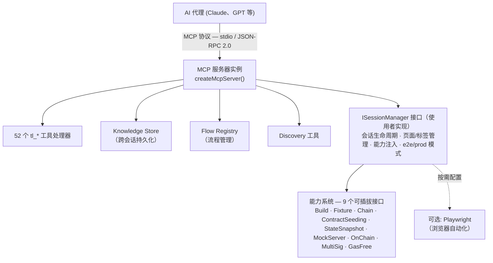

# TronLink MCP Core 

## 概述

**GitHub**: [https://github.com/TronLink/tronlink-mcp-core](https://github.com/TronLink/tronlink-mcp-core)

**@tronlink/tronlink-mcp-core** 是构建 TronLink MCP（Model Context Protocol）服务器的基础框架库。它不是独立应用——使用者必须实现 `ISessionManager` 接口并注入能力模块来创建可运行的服务器。

**核心亮点：**
- 接口驱动的可插拔架构，提供 **9 个能力接口**
- **52 预定义工具处理器**，使用 Zod 验证 Schema
- 内置 Knowledge Store，支持跨会话学习和步骤回放
- Flow Recipe 系统，将多步骤工作流程模板化
- 标准化响应格式 + 结构化错误码表（`code` / `retryable` / `hint`）
- 双模支持：Playwright（UI 自动化）+ Direct API（链上操作）

---

## 架构设计



**设计原则：**
1. **接口驱动** — 所有主要组件使用接口实现可扩展性
2. **组合优于继承** — 能力通过注入，而非继承
3. **单例模式** — SessionManager、KnowledgeStore、FlowRegistry 使用全局持有者
4. **预检查** — 链上工具在执行前验证
5. **数据脱敏** — Knowledge Store 自动屏蔽敏感字段

---

## 与 mcp-server-tronlink 的关系

| 维度 | tronlink-mcp-core | mcp-server-tronlink |
|------|-------------------|---------------------|
| 类型 | 核心库（框架） | 独立 MCP 服务器 |
| 角色 | 定义接口、工具、协议 | 具体实现 |
| 使用方式 | 通过 npm 导入并扩展 | 直接 CLI 调用 |
| 可扩展性 | 9 个可插拔能力接口 | 预配置能力 |
| 依赖关系 | 无（它本身就是依赖） | 依赖 @tronlink/tronlink-mcp-core |

**mcp-server-tronlink 是 tronlink-mcp-core 的使用者。** 核心库定义了工具"是什么"；服务器提供了工具"怎么工作"。

---

## ISessionManager 接口

使用者必须实现的关键接口（25+ 方法）：

### 会话生命周期
```typescript
hasActiveSession(): boolean
getSessionId(): string
getSessionState(): SessionState
getSessionMetadata(): SessionMetadata
launch(input: LaunchInput): Promise<LaunchResult>
cleanup(): Promise<void>
```

### 页面管理
```typescript
getPage(): Page
setActivePage(page: Page): void
getTrackedPages(): TrackedPage[]
classifyPageRole(page: Page): PageRole
getContext(): ContextInfo
```

### 扩展状态
```typescript
getExtensionState(): Promise<ExtensionState>
```

### 无障碍引用
```typescript
setRefMap(map: Map<string, any>): void
getRefMap(): Map<string, any>
clearRefMap(): void
resolveA11yRef(ref: string): any
```

### 导航
```typescript
navigateToHome(): Promise<void>
navigateToSettings(): Promise<void>
navigateToUrl(url: string): Promise<void>
navigateToNotification(): Promise<void>
waitForNotificationPage(timeoutMs?: number): Promise<Page>
```

### 截图
```typescript
screenshot(options?: ScreenshotOptions): Promise<ScreenshotResult>
```

### 能力获取器（9 个，均可选）
```typescript
getBuildCapability(): BuildCapability | undefined
getFixtureCapability(): FixtureCapability | undefined
getChainCapability(): ChainCapability | undefined
getContractSeedingCapability(): ContractSeedingCapability | undefined
getStateSnapshotCapability(): StateSnapshotCapability | undefined
getMockServerCapability(): MockServerCapability | undefined
getOnChainCapability(): OnChainCapability | undefined
getMultiSigCapability(): MultiSigCapability | undefined
getGasFreeCapability(): GasFreeCapability | undefined
```

### 环境
```typescript
getEnvironmentMode(): 'e2e' | 'prod'
setContext(context: string, options?: any): Promise<void>
getContextInfo(): ContextInfo
```

---

## 9 个能力接口

每个能力都是可选的，可独立注入：

### 1. BuildCapability
从源码构建 TronLink 扩展。
```typescript
interface BuildCapability {
  build(options?: BuildOptions): Promise<BuildResult>
}
```

### 2. FixtureCapability
管理钱包状态 JSON（default、onboarding、自定义预设）。
```typescript
interface FixtureCapability {
  applyPreset(preset: string): Promise<void>
  getAvailablePresets(): string[]
  exportState(): Promise<WalletState>
  importState(state: WalletState): Promise<void>
}
```

### 3. ChainCapability
控制本地 TRON 节点（tron-quickstart 等）。
```typescript
interface ChainCapability {
  startNode(): Promise<void>
  stopNode(): Promise<void>
  getNodeStatus(): Promise<NodeStatus>
  fundAccount(address: string, amount: number): Promise<string>
}
```

### 4. ContractSeedingCapability
部署智能合约（TRC20/721/1155/10/multisig/staking/energy_rental）。
```typescript
interface ContractSeedingCapability {
  seedContract(type: string, options?: any): Promise<ContractInfo>
  seedContracts(specs: ContractSpec[]): Promise<ContractInfo[]>
  getContractAddress(name: string): string | undefined
  listContracts(): ContractInfo[]
}
```

### 5. StateSnapshotCapability
从 UI 提取钱包状态（界面、地址、余额、能量、带宽）。
```typescript
interface StateSnapshotCapability {
  getSnapshot(): Promise<StateSnapshot>  // 界面、地址、余额、能量、带宽
}
```

### 6. MockServerCapability
用于隔离测试的 Mock API 服务器。
```typescript
interface MockServerCapability {
  start(config?: MockConfig): Promise<void>
  stop(): Promise<void>
  addRoute(route: MockRoute): void
  getRequests(): MockRequest[]
}
```

### 7. OnChainCapability
通过 TronGrid REST API 的直接链上操作。
```typescript
interface OnChainCapability {
  getAddress(): Promise<AddressResult>
  getAccount(address?: string): Promise<AccountResult>
  getTokens(address?: string): Promise<TokensResult>
  send(params: SendParams): Promise<SendResult>
  getTransaction(txId: string): Promise<TxResult>
  getHistory(params?: HistoryParams): Promise<HistoryResult>
  stake(params: StakeParams): Promise<StakeResult>
  getStakingInfo(address?: string): Promise<StakingResult>
  resource(params: ResourceParams): Promise<ResourceResult>
  swap(params: SwapParams): Promise<SwapResult>
  swapV3(params: SwapV3Params): Promise<SwapResult>
  setupMultisig(params: MultisigSetupParams): Promise<MultisigResult>
  createMultisigTx(params: MultisigTxParams): Promise<MultisigTxResult>
  signMultisigTx(params: SignMultisigParams): Promise<SignResult>
}
```

### 8. MultiSigCapability
多签服务集成（REST + WebSocket）。
```typescript
interface MultiSigCapability {
  queryAuth(address: string): Promise<AuthResult>
  submitTransaction(params: SubmitParams): Promise<SubmitResult>
  queryTransactionList(params: ListParams): Promise<TxListResult>
  connectWebSocket(params: WsParams): Promise<void>
  disconnectWebSocket(): Promise<void>
}
```

### 9. GasFreeCapability
零 Gas TRC20 转账服务。
```typescript
interface GasFreeCapability {
  getAccount(address: string): Promise<GasFreeAccountResult>
  getTransactions(params: GasFreeTxParams): Promise<GasFreeTxResult>
  send(params: GasFreeSendParams): Promise<GasFreeSendResult>
}
```

---

## 52 工具定义

所有工具使用 `tl_` 前缀，分为 13 个类别：

> **Schema SSOT。** 每个工具的 `inputSchema` 都由 [`src/mcp-server/schemas.ts`](https://github.com/TronLink/tronlink-mcp-core/blob/main/src/mcp-server/schemas.ts) 中的 Zod schema 生成，运行时通过 `list_tools` 暴露。下方表格只列**工具名 + 一句话描述**；参数类型、必填字段、枚举值和默认值请对运行中的 server 调用 `list_tools`，或直接读 Zod 源码。下游 [`mcp-server-tronlink` 页面](mcp-server-tronlink.md#selected-tool-schemas-inline-mirror) 为 7 个高影响工具（`tl_chain_send`、`tl_chain_swap_v3`、`tl_chain_stake`、`tl_multisig_submit_tx`、`tl_gasfree_send`、`tl_chain_get_account`、`tl_evaluate`）镜像了 JSON Schema——便于 agent 在没打开 MCP 会话时写调用站点。SSOT 仍然是本包。

### 1. 会话管理（2 个）
| 工具 | 说明 |
|------|------|
| `tl_launch` | 启动带扩展的浏览器 |
| `tl_cleanup` | 关闭浏览器和服务 |

### 2. 状态与发现（4 个）
| 工具 | 说明 |
|------|------|
| `tl_get_state` | 获取钱包状态 |
| `tl_describe_screen` | 包含状态 + testIds + a11y + 截图的界面描述 |
| `tl_list_testids` | 列出 data-testid 属性 |
| `tl_accessibility_snapshot` | 获取带引用的无障碍树 (e1, e2...) |

### 3. 导航（4 个）
| 工具 | 说明 |
|------|------|
| `tl_navigate` | 导航到 TronLink 界面或 URL |
| `tl_switch_to_tab` | 按角色/URL 切换标签页 |
| `tl_close_tab` | 关闭标签页 |
| `tl_wait_for_notification` | 等待确认弹窗 |

### 4. UI 交互（6 个）
| 工具 | 说明 |
|------|------|
| `tl_click` | 点击元素（a11yRef、testId、selector） |
| `tl_type` | 在输入框中输入文本 |
| `tl_wait_for` | 等待元素状态 |
| `tl_scroll` | 滚动页面/元素 |
| `tl_keyboard` | 发送键盘事件 |
| `tl_evaluate` | 执行 JavaScript |

### 5. 截图与剪贴板（2 个）
| 工具 | 说明 |
|------|------|
| `tl_screenshot` | 捕获屏幕 |
| `tl_clipboard` | 读写剪贴板 |

### 6. 合约部署 — 仅 e2e（4 个）
| 工具 | 说明 |
|------|------|
| `tl_seed_contract` | 部署单个合约 |
| `tl_seed_contracts` | 批量部署合约 |
| `tl_get_contract_address` | 查询合约地址 |
| `tl_list_contracts` | 列出已部署合约 |

### 7. 上下文管理（2 个）
| 工具 | 说明 |
|------|------|
| `tl_set_context` | 切换 e2e/prod 模式 |
| `tl_get_context` | 获取上下文信息 |

### 8. Knowledge Store（4 个）
| 工具 | 说明 |
|------|------|
| `tl_knowledge_last` | 获取最近 N 个步骤 |
| `tl_knowledge_search` | 搜索历史 |
| `tl_knowledge_summarize` | 生成配方 |
| `tl_knowledge_sessions` | 列出会话 |

### 9. Flow Recipes（1 个）
| 工具 | 说明 |
|------|------|
| `tl_list_flows` | 列出/获取流程配方 |

### 10. 批量执行（1 个）
| 工具 | 说明 |
|------|------|
| `tl_run_steps` | 顺序执行多个步骤 |

### 11. 链上操作（14 个）
| 工具 | 说明 |
|------|------|
| `tl_chain_get_address` | 从本地加密 agent-wallet 获取当前地址（绝不接触明文私钥） |
| `tl_chain_get_account` | 查询账户详情 |
| `tl_chain_get_tokens` | 查询 TRC10/TRC20 余额 |
| `tl_chain_send` | 发送 TRX/TRC10/TRC20 |
| `tl_chain_get_tx` | 获取交易详情 |
| `tl_chain_get_history` | 查询交易历史 |
| `tl_chain_stake` | 冻结/解冻 TRX (Stake 2.0) |
| `tl_chain_get_staking` | 查询质押信息 |
| `tl_chain_resource` | 代理/取消代理资源 |
| `tl_chain_swap` | SunSwap V2 兑换 |
| `tl_chain_swap_v3` | SunSwap V3 兑换 |
| `tl_chain_setup_multisig` | 配置多签权限 |
| `tl_chain_create_multisig_tx` | 创建未签名多签交易 |
| `tl_chain_sign_multisig_tx` | 签署多签交易 |

### 12. 多签管理（5 个）
| 工具 | 说明 |
|------|------|
| `tl_multisig_query_auth` | 查询多签权限 |
| `tl_multisig_submit_tx` | 提交签名交易 |
| `tl_multisig_list_tx` | 列出多签交易 |
| `tl_multisig_connect_ws` | 连接 WebSocket |
| `tl_multisig_disconnect_ws` | 断开 WebSocket |

### 13. GasFree（3 个）
| 工具 | 说明 |
|------|------|
| `tl_gasfree_get_account` | 查询资格与配额 |
| `tl_gasfree_get_transactions` | 查询交易历史 |
| `tl_gasfree_send` | 零 Gas 发送 |

---

## 标准化响应格式

所有工具返回一致的结构：

```typescript
// 成功
{
  ok: true,
  result: { /* 工具特定数据 */ },
  meta: {
    timestamp: "2026-03-09T10:15:23.456Z",
    sessionId: "tl-1741504523",
    durationMs: 234
  }
}

// 错误
{
  ok: false,
  error: {
    code: "TL_CLICK_FAILED",       // 稳定错误码 — 见下表
    message: "Element not found",
    retryable: false,              // 给 agent 的显式提示
    hint: "重新生成可达性快照并用新的 a11yRef 重试。",
    details: { /* 可选 */ }
  },
  meta: { timestamp, sessionId, durationMs, schemaVersion: "1.0" }
}
```

### 错误码 {#error-codes}

这是本框架所有工具返回错误码的**唯一数据源**（SSOT）。下游 server（`mcp-server-tronlink`、`mcp-tronlink-signer`）继承这些错误码并可扩展自有错误码。`retryable` 反映框架层面的安全性，agent 仍**必须**叠加调用工具的副作用分级——无论 `retryable` 为何，**结果未确认的 Remote Write 绝不能自动重试**。

| 错误码 | Retryable | Hint | 典型触发 |
|---|:---:|---|---|
| `TL_BUILD_FAILED` | false | 检查 build 日志，修正源码/配置后再试。 | 启用 `BuildCapability` 时的 `tl_launch` |
| `TL_SESSION_ALREADY_RUNNING` | false | 先调用 `tl_cleanup` 再启动新会话。 | 已有 session 时再次 `tl_launch` |
| `TL_NO_ACTIVE_SESSION` | false | 先调用 `tl_launch`。 | 任何需要 session 的工具，但 session 不存在 |
| `TL_LAUNCH_FAILED` | true | 浏览器/扩展启动暂时失败；可重试一次。 | `tl_launch` |
| `TL_INVALID_INPUT` | false | 修正参数后再试，禁止用相同 payload 重发。 | Zod schema 校验失败 |
| `TL_NAVIGATION_FAILED` | true | 页面可能仍在过渡；等待目标屏出现后重试。 | `tl_navigate`、`tl_switch_to_tab` |
| `TL_TARGET_NOT_FOUND` | false | 用 `tl_accessibility_snapshot` 刷新 ref 后重试。 | `tl_click`、`tl_type`、`tl_wait_for` |
| `TL_CLICK_FAILED` | true | 元素可能已重渲染；刷新 ref 后重试一次。 | `tl_click` |
| `TL_TYPE_FAILED` | true | 同 click——刷新 ref 后重试一次。 | `tl_type` |
| `TL_WAIT_TIMEOUT` | true | 提高超时或换一个 selector。 | `tl_wait_for`、`tl_wait_for_notification` |
| `TL_SCREENSHOT_FAILED` | true | 偶发故障；可重试。 | `tl_screenshot`、`tl_describe_screen` |
| `TL_CAPABILITY_NOT_AVAILABLE` | false | 当前 session 未注入该 capability；重配后重启。 | 依赖可选 capability 的工具 |
| `TL_CHAIN_QUERY_FAILED` | true | TronGrid 暂时不可用或限流；退避后重试。 | `tl_chain_get_*` |
| `TL_CHAIN_SEND_FAILED` | false | **禁止**自动重试。先用 `tl_chain_get_tx` 确认上一笔是否落账。 | `tl_chain_send`、`tl_chain_stake`、`tl_chain_resource` |
| `TL_CHAIN_SWAP_FAILED` | false | 同上——重试前必须确认前一笔未落账。 | `tl_chain_swap`、`tl_chain_swap_v3` |
| `TL_GASFREE_QUERY_FAILED` | true | 偶发故障；可重试。 | `tl_gasfree_get_account`、`tl_gasfree_get_transactions` |
| `TL_GASFREE_SEND_FAILED` | false | **禁止**自动重试；先向 GasFree 查询最新状态。 | `tl_gasfree_send` |
| `TL_MULTISIG_QUERY_FAILED` | true | 偶发故障；可重试。 | `tl_multisig_query_auth`、`tl_multisig_list_tx` |
| `TL_MULTISIG_SUBMIT_FAILED` | false | **禁止**自动重试；请求可能已被接受。 | `tl_multisig_submit_tx` |
| `TL_MULTISIG_WS_FAILED` | true | 重新连接 WebSocket。 | `tl_multisig_connect_ws` |
| `TL_INTERNAL_ERROR` | true | 框架通用错误；重试一次后带日志上报。 | 任意工具 |

下游 server 扩展自定义错误码必须满足：

- 不复用上表错误码表达不同含义。
- 每个新错误码必须声明 `retryable`。
- major 版本内含义稳定。
- 新错误码在使用方文档说明，禁止悄悄引入。

---

## Knowledge Store

跨会话学习和步骤回放系统。

### 存储结构
```text
test-artifacts/llm-knowledge/
├── tl-1741504523/
│   ├── session.json
│   └── steps/
│       ├── 2026-03-09T10-15-23-456Z-tl_click.json
│       └── ...
└── tl-1741504600/
    └── ...
```

### 特性
- **自动记录：** 每次工具调用都被记录（时间戳、界面、目标、结果）
- **敏感数据脱敏：** 密码、助记词、私钥、种子自动屏蔽
- **搜索：** 按工具名、界面、testId、无障碍名称查询
- **摘要生成：** 从会话历史生成可复用的"配方"
- **会话管理：** 带元数据的会话列表

---

## Flow Recipe 系统

将常见多步骤工作流程模板化，支持参数替换。

### FlowRecipe 结构
```typescript
{
  id: "transfer_trx",
  name: "发送 TRX",
  description: "向另一个地址转账 TRX",
  context: "both",                      // "playwright" | "api" | "both"
  preconditions: ["钱包已解锁"],
  params: [
    { name: "recipient", description: "目标 TRON 地址", required: true },
    { name: "amount", description: "TRX 金额", required: true }
  ],
  steps: [
    { tool: "navigate", input: { target: "send" } },
    { tool: "type", input: { testId: "address-input", text: "{{recipient}}" } },
    { tool: "type", input: { testId: "amount-input", text: "{{amount}}" } },
    { tool: "click", input: { a11yRef: "e5" } }
  ],
  tags: ["transfer", "basic"]
}
```

---

## 元素定位（3 种方式）

```typescript
// 1. 无障碍引用（推荐）
tl_click({ a11yRef: "e5" })

// 2. data-testid
tl_click({ testId: "send-button" })

// 3. CSS 选择器
tl_click({ selector: ".confirm-btn" })
```

无障碍引用来自 `tl_accessibility_snapshot` 输出——最可靠的定位方式。

---

## 安装与使用

### 安装
```bash
npm install @tronlink/tronlink-mcp-core
```

### 基础使用
```typescript
import {
  createMcpServer,
  setSessionManager,
  type ISessionManager,
} from '@tronlink/tronlink-mcp-core';

// 1. 实现 ISessionManager
class MySessionManager implements ISessionManager {
  // ... 实现全部 25+ 方法
}

// 2. 注册
setSessionManager(new MySessionManager());

// 3. 创建并启动服务器
const server = createMcpServer({
  name: 'My TronLink Server',
  version: '1.0.0',
});

await server.start();
```

---

## 项目结构

```text
tronlink-mcp-core/
├── src/
│   ├── index.ts                           # 公共 API 导出
│   ├── mcp-server/
│   │   ├── server.ts                      # createMcpServer() 工厂函数
│   │   ├── session-manager.ts             # ISessionManager 接口
│   │   ├── knowledge-store.ts             # 持久化步骤记录
│   │   ├── discovery.ts                   # 页面检查工具
│   │   ├── schemas.ts                     # Zod 验证 Schema
│   │   ├── constants.ts                   # 超时、限制、URL、界面常量
│   │   ├── tools/                         # 52 工具处理器
│   │   ├── types/                         # 类型定义
│   │   └── utils/                         # 工具函数
│   ├── capabilities/
│   │   ├── types.ts                       # 9 个能力接口
│   │   └── context.ts                     # 环境配置类型
│   ├── flows/
│   │   ├── types.ts                       # FlowRecipe 类型
│   │   └── registry.ts                    # FlowRegistry 类
│   ├── launcher/
│   │   ├── extension-id-resolver.ts       # 扩展 ID 提取
│   │   └── extension-readiness.ts         # 扩展加载检测
│   └── utils/
│       └── index.ts                       # 工具函数
├── dist/                                  # 编译输出 + .d.ts
├── package.json
├── tsconfig.json
└── README.md
```

---

## 依赖项

| 包名 | 版本 | 用途 |
|------|------|------|
| `@modelcontextprotocol/sdk` | ^1.12.0 | MCP 协议实现 |
| `zod` | ^3.23.0 | 输入验证 Schema |

**可选对等依赖：**

| 包名 | 版本 | 用途 |
|------|------|------|
| `playwright` | ^1.49.0 | 浏览器自动化（仅 Playwright 模式） |
| `@playwright/test` | ^1.49.0 | 测试工具 |

---

## 构建与开发

```bash
npm run build      # 编译 TypeScript 到 dist/
npm run dev        # 监视模式
npm run test       # 运行 Vitest 测试
npm run lint       # ESLint
npm run clean      # 删除 dist/
```

---

## 关键设计模式

1. **全局单例** — `setSessionManager()` / `getSessionManager()`，`setKnowledgeStore()` / `getKnowledgeStore()`，`FlowRegistry.getInstance()`
2. **组合优于继承** — 能力通过 getter 方法注入，而非类层次结构
3. **接口隔离** — 每个能力都有专注的最小接口
4. **预检查** — 链上工具在发送交易前验证余额、权限、配额
5. **数据脱敏** — Knowledge Store 自动屏蔽 password、mnemonic、private_key、seed 字段
6. **标准化响应** — 所有 52 工具使用一致的 `{ ok, result/error, meta }` 结构
7. **模板系统** — Flow Recipes 使用 `{{param}}` 占位符实现可复用工作流

## 版本与许可证

- **包：** `@tronlink/tronlink-mcp-core` v0.1.0
- **许可证：** MIT —— `SPDX-License-Identifier: MIT`
- **变更记录 / 发布：** [https://github.com/TronLink/tronlink-mcp-core/releases](https://github.com/TronLink/tronlink-mcp-core/releases) —— 截至当前尚无 GitHub tag 发布；1.0 之前通过 `package.json` 版本号迭代。打 tag 之前请直接看 commit 历史。

### 兼容性与迁移策略

本包是 `mcp-server-tronlink` 及任何下游 MCP server 在工具 schema、错误码、`meta.schemaVersion` 上的 **SSOT**，兼容面比普通库更宽：

- **语义化版本。** 1.0 之前：**minor** 升级可能改 `ISessionManager` 接口、能力 shape、`Tool[]` 注册顺序；**patch** 不会。1.0 之后：标准 semver，仅 major 允许破坏。
- **稳定契约**（patch 不会动）：
    - `error.code` 枚举（导出为 `ERROR_CODES`，SSOT）——新增 code 非破坏；改名或删除是破坏。
    - `{ ok, result/error, meta }` 响应包络与 `meta.schemaVersion` 的 major 分量。
    - 工具名与各工具 `inputSchema` 的**结构**——新增可选字段非破坏；改名或将字段改必填是破坏。
    - 9 个能力接口（`OnChainCapability`、`MultiSigCapability`…）——新增可选方法非破坏。
- **不稳定契约**（随时可能变化）：
    - `src/internal/*` 下的内部 helper 导出、Knowledge Store key、recipe-runner 内部。
    - 预检查错误 `details` 文本（分支用 `code`，别用 `details.reason`）。
- **废弃窗口。** 废弃的工具 / 字段 / 能力方法在 `list_tools` 中带 `meta.deprecated` 标记，至少保留 **一个 minor 周期** 与替代并存，移除最早发生在再下一周期。
- **下游升级。** 升级 `@tronlink/tronlink-mcp-core` 之前，先在下游对新 core 跑一遍 `list_tools` 快照测试；断言 `meta.schemaVersion` major 与你的 harness 编写时一致。
